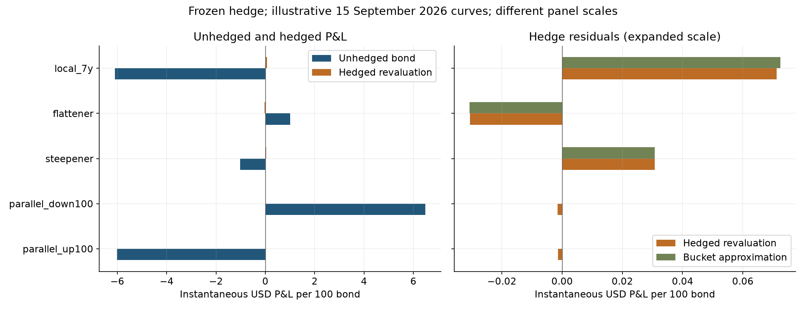

# Curves, conventions and hedging with QuantLib

Under the explicit illustrative inputs, a bond priced at **103.195569 per 100** is parallel-DV01-neutralized with **1.009745 units** of a payer swap (each unit has notional 100). The largest absolute residual among five frozen instantaneous scenarios is **0.071261 per 100**, in **local_7y**. A single parallel hedge leaves curve-shape and convexity risk.

All prices in this study are explicitly constructed numerical inputs, not observed market quotes. The contribution is a validated, inspectable comparison with explicit limitations. Original code and notebooks are preserved on branch `old`; the maintained revision is on `renovation`.

## Read the study

- [Executed notebook](study.ipynb): methods, calculations, original figures and independent checks.
- [Inputs and methods](docs/01-methods.md) → [results and implications](docs/02-results.md).
- [Audit](research/AUDIT.md), [protocol](research/PROTOCOL.md), [sources](research/SOURCES.md), [next unrun experiment](research/RESEARCH_AGENDA.md).



## Reproduce in WSL/Linux

Use Python 3.12 and the committed uv lockfile. Run from this repository:

```bash
uv sync --locked
uv run python -m pytest -q
uv run python research/run_study.py
uv run python research/build_notebook.py
uv run python research/check_artifacts.py
uv run python -m ruff check research tests
uv run python -m ruff format --check research tests
```

## Repository and validation boundary

`research/` contains reusable model, data, evaluation and reporting code. Summary evidence is under `research/results/`, figures under `research/figures/`, and tests under `tests/`. Detailed empirical paths and raw snapshots are local and ignored where provider rights remain unresolved. `research/WORKLOG.md` records recovery commands and actual verification. The report is saved only after complete fresh-kernel execution.

CI runs locked setup, known-answer/timing/accounting tests and public-file checks; it does not certify market data, transaction execution or the complete historical analysis. See [publication review](PUBLICATION.md) for current-file and historical-data limits. No remote push or live publication was performed.
